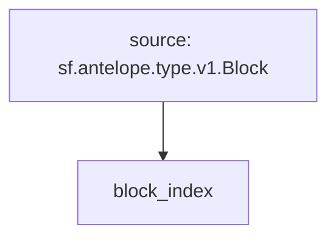

# Antelope Block Index

> Antelope Block Index for transaction traces, actions & database operations.

## Quickstart

```
$ gh repo clone pinax-network/substreams-antelope-block-index
$ cd substreams-antelope-block-index
$ make
$ make gui
```

## Releases

- https://github.com/pinax-network/substreams-antelope-block-index/releases

## Key Formats

| Key | Description |
| --- | ----------- |
| `receiver=receiver` | `receiver` is the account name of the receiver of the action. |
| `action=account::name` | `account` is the account name of the contract that published the action. `name` is the name of the action. |
| `authorization=actor@permission` | `actor` is the account name of the actor. `permission` is the permission level of the actor. |
| `db_op=code::table_name` | `code` is the account name of the contract that published the database operation. `table_name` is the name of the table. |

### Mermaid Graph



### Modules

```yaml
Package name: antelope_common
Version: v0.1.0
Doc: Antelope Block Index for transaction traces, actions & database operations.
Modules:
----
Name: block_index
Initial block: 0
Kind: index
Input: source: sf.antelope.type.v1.Block
Output Type: proto:sf.substreams.index.v1.Keys
Hash: efcae5cf0c0a7b9eb5ddb1eea458e40a84e44731
```
